# 시스템 아키텍처 상세 설계

## 전체 시스템 구조

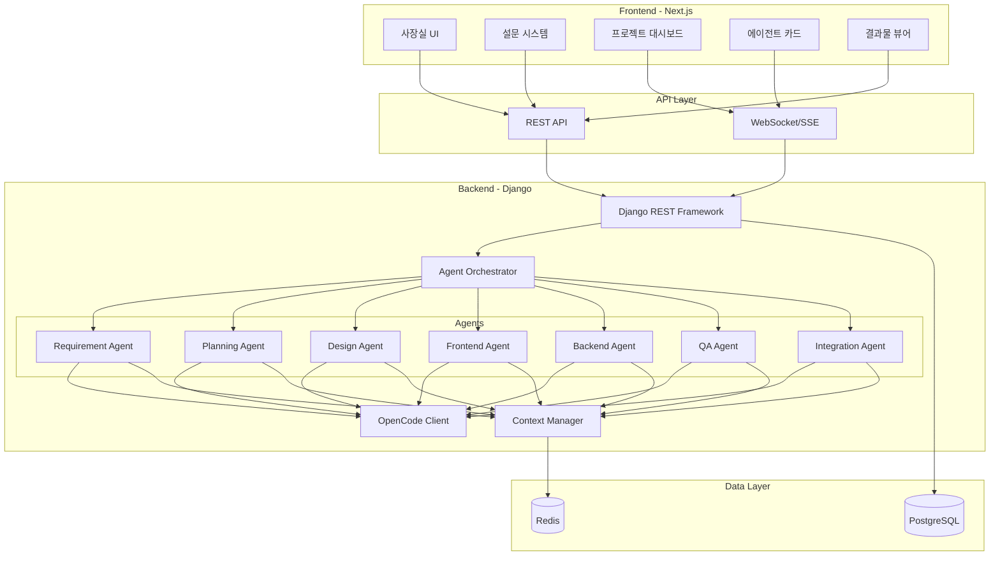

## 에이전트 실행 플로우

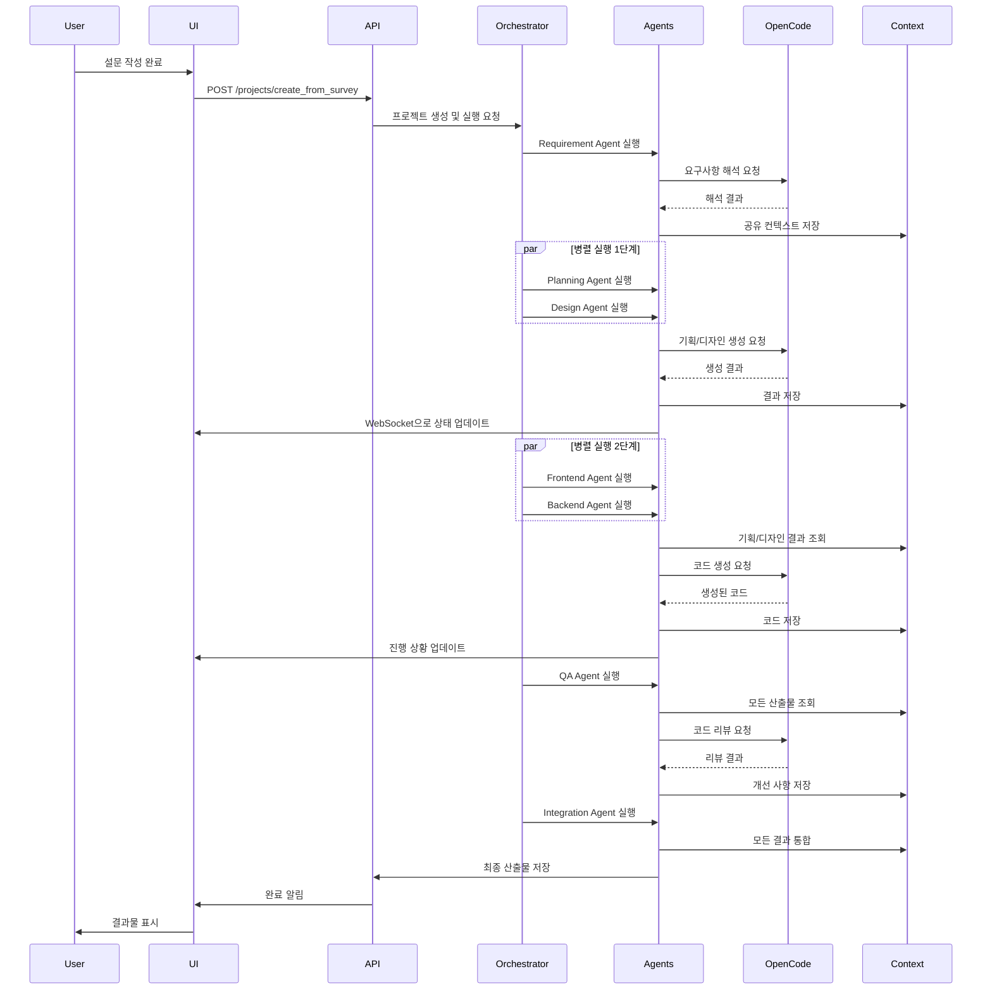

## 에이전트 의존성 그래프

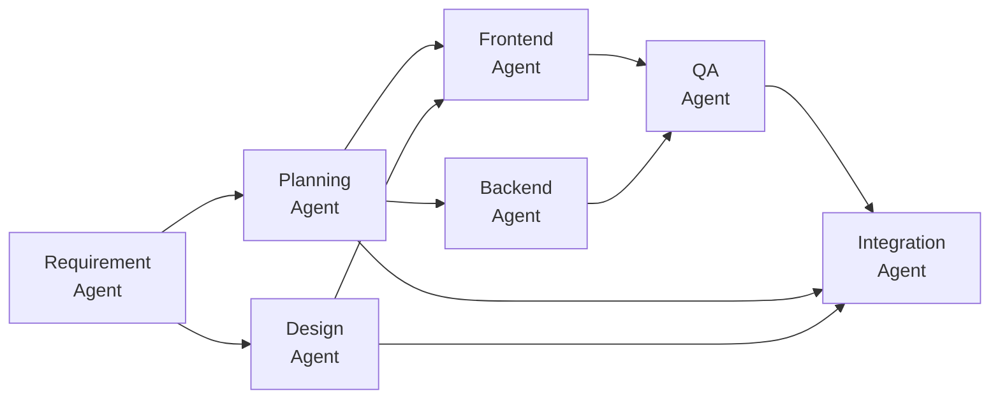

## 데이터 모델 ERD

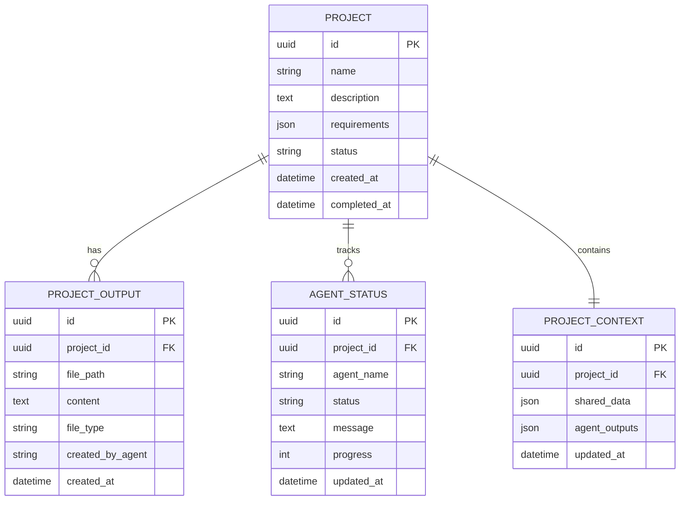

## 컴포넌트 구조 (Frontend)

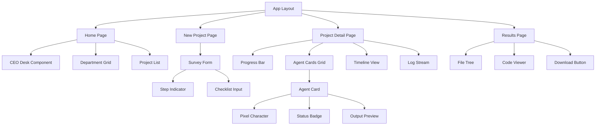

## 상태 관리 플로우

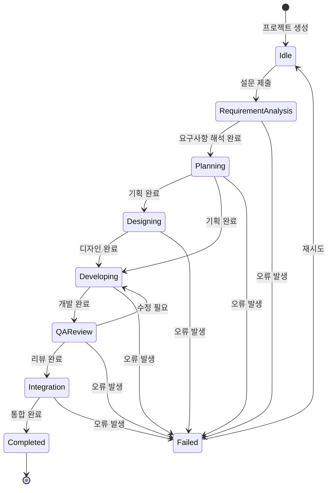

## API 엔드포인트 구조

### REST API

| Method | Endpoint | Description |
|--------|----------|-------------|
| GET | `/api/projects/` | 프로젝트 목록 조회 |
| POST | `/api/projects/` | 프로젝트 생성 |
| GET | `/api/projects/{id}/` | 프로젝트 상세 조회 |
| POST | `/api/projects/create_from_survey/` | 설문으로 프로젝트 생성 |
| GET | `/api/projects/{id}/status/` | 프로젝트 진행 상황 |
| GET | `/api/projects/{id}/outputs/` | 프로젝트 산출물 목록 |
| GET | `/api/projects/{id}/download/` | 전체 산출물 다운로드 |
| POST | `/api/projects/{id}/regenerate/` | 특정 부서 재실행 |
| GET | `/api/agents/` | 에이전트 목록 |
| GET | `/api/agents/{name}/status/` | 에이전트 상태 조회 |

### WebSocket

| Event | Direction | Description |
|-------|-----------|-------------|
| `connect` | Client → Server | 프로젝트 구독 시작 |
| `agent_update` | Server → Client | 에이전트 상태 업데이트 |
| `progress_update` | Server → Client | 전체 진행률 업데이트 |
| `output_created` | Server → Client | 새 산출물 생성 알림 |
| `error` | Server → Client | 오류 발생 알림 |
| `completed` | Server → Client | 프로젝트 완료 알림 |

## 보안 고려사항

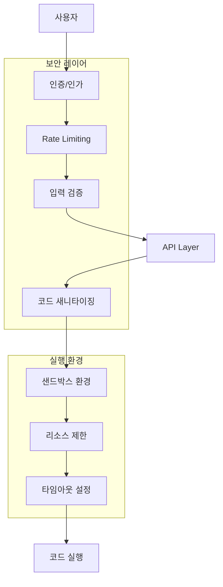

## 확장 가능성

### 플러그인 아키텍처

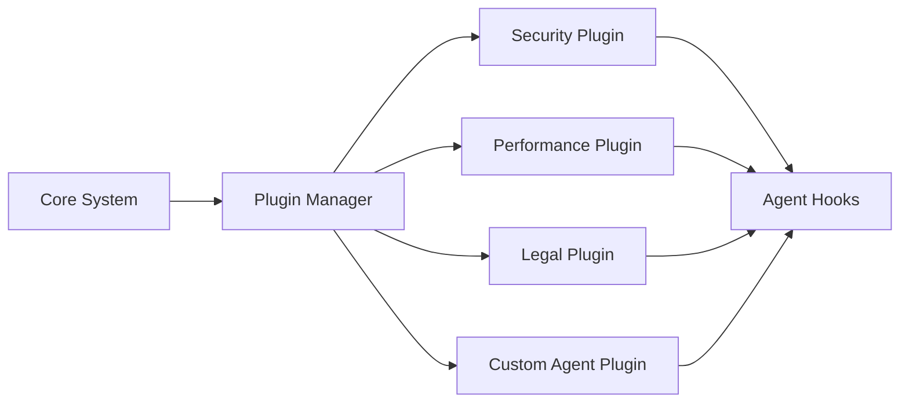

### 템플릿 시스템

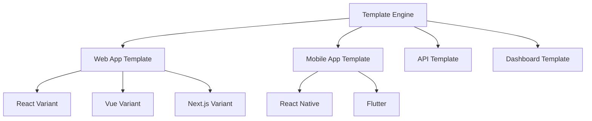

## 성능 최적화 전략

### 캐싱 전략

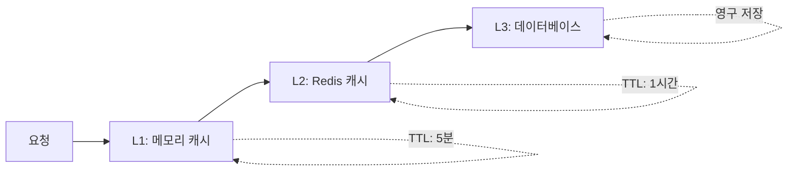

### 병렬 처리 최적화

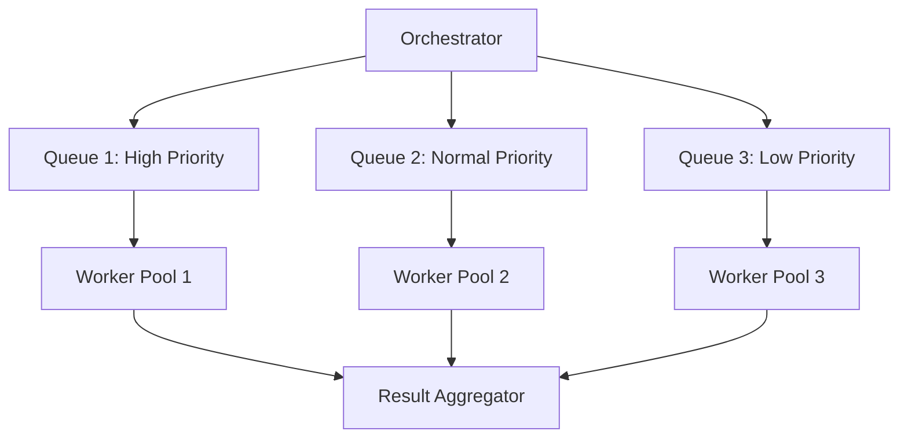

## 모니터링 및 로깅

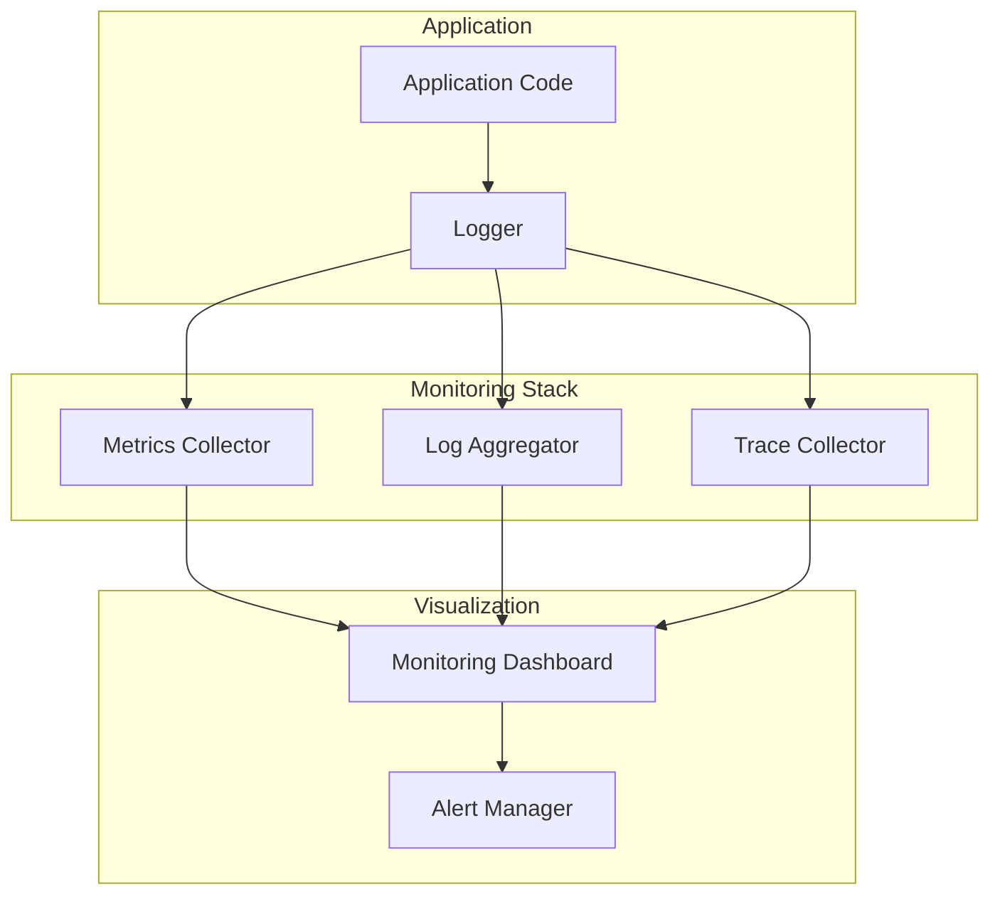

## 배포 아키텍처

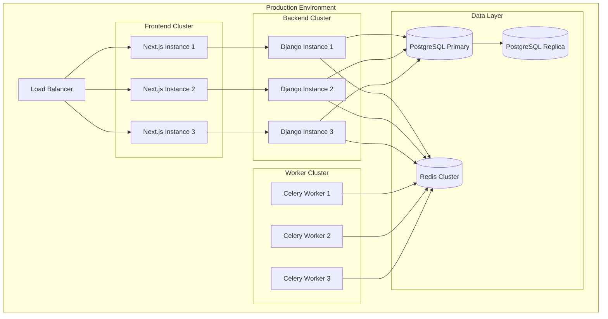

## 개발 환경 설정

### Docker Compose 구조

```yaml
services:
  frontend:
    - Next.js Development Server
    - Hot Reload
    - Port: 3000
  
  backend:
    - Django Development Server
    - Auto Reload
    - Port: 8000
  
  postgres:
    - PostgreSQL 15
    - Port: 5432
  
  redis:
    - Redis 7
    - Port: 6379
  
  celery:
    - Celery Worker
    - Celery Beat
```

이 아키텍처는 확장 가능하고 유지보수가 용이하며, 각 컴포넌트가 독립적으로 개발 및 배포될 수 있도록 설계되었습니다.