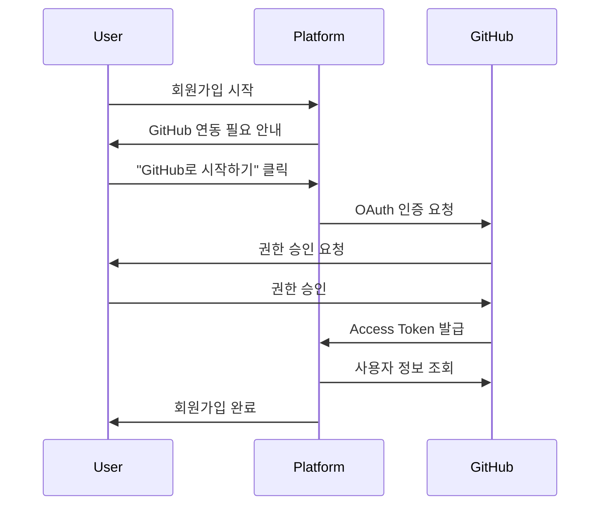
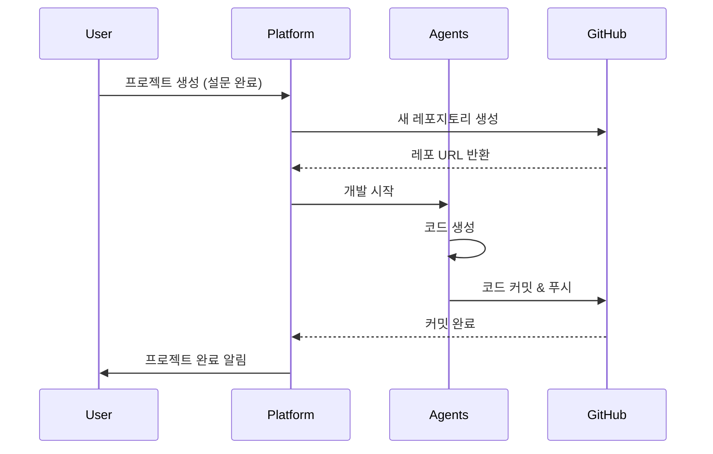
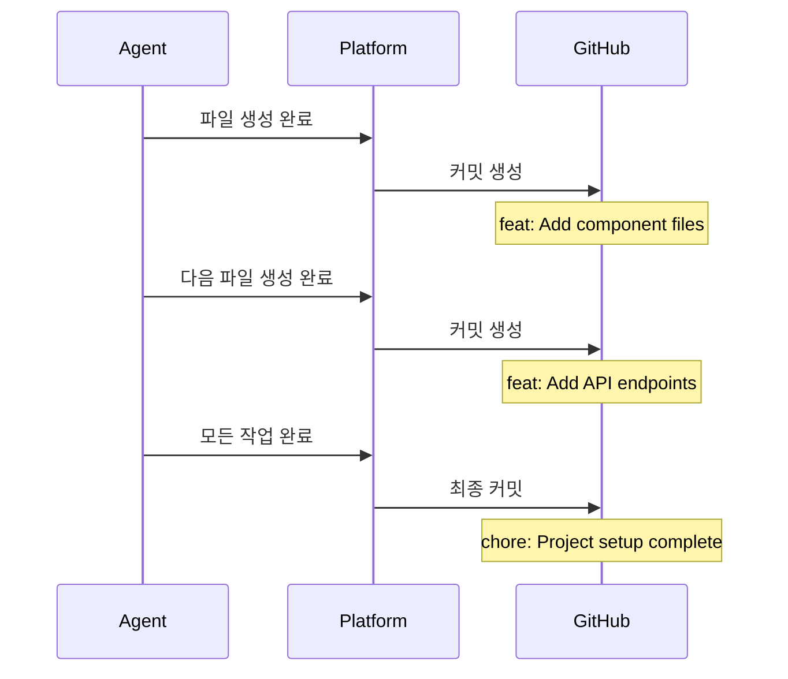

# GitHub 통합 가이드

## 개요

**My Dev Company**는 일반인을 위한 노코드 플랫폼입니다. 사용자는 코드를 전혀 볼 필요 없이, 모든 코드 관리는 GitHub를 통해 자동으로 이루어집니다.

## 핵심 원칙

1. **코드 비노출**: 플랫폼 내에서 사용자는 코드를 볼 수 없음
2. **GitHub 중심**: 모든 코드는 GitHub 레포지토리에서 관리
3. **자동화**: 프로젝트 생성 시 GitHub 레포 자동 생성
4. **투명성**: 개발 과정은 보이지만, 코드는 숨김

---

## 사용자 플로우

### 1. 회원가입 및 GitHub 연동



#### 신규 사용자 (GitHub 계정 없음)
```
1. "GitHub로 시작하기" 클릭
2. GitHub 회원가입 페이지로 리다이렉트
3. GitHub 계정 생성
4. 플랫폼으로 돌아와 자동 연동
```

#### 기존 GitHub 사용자
```
1. "GitHub로 시작하기" 클릭
2. GitHub 로그인
3. 권한 승인
4. 플랫폼 계정 자동 생성
```

### 2. 프로젝트 생성 및 GitHub 레포 자동 생성



#### 레포지토리 생성 규칙
```
레포지토리 이름: {project-name}-{timestamp}
예시: todo-app-20240207
가시성: Private (기본값)
초기 파일: README.md, .gitignore
브랜치: main
```

### 3. 개발 진행 중 GitHub 커밋



#### 커밋 메시지 규칙
```
부서별 커밋 프리픽스:
- 기획부: docs: 
- 디자인부: design: 
- 개발부(FE): feat(frontend): 
- 개발부(BE): feat(backend): 
- QA부: test: 
- 통합부: chore: 

예시:
- docs: Add project requirements
- design: Add UI component structure
- feat(frontend): Implement TodoList component
- feat(backend): Add user authentication API
- test: Add unit tests for API
- chore: Setup project configuration
```

---

## GitHub OAuth 설정

### 필요한 권한 (Scopes)

```
repo              # 레포지토리 생성 및 관리
user:email        # 사용자 이메일 조회
read:user         # 사용자 프로필 조회
workflow          # GitHub Actions 관리 (선택)
```

### OAuth 앱 설정

**GitHub Developer Settings**:
```
Application name: My Dev Company
Homepage URL: https://mydevcompany.com
Authorization callback URL: https://mydevcompany.com/auth/github/callback
```

**환경 변수**:
```env
GITHUB_CLIENT_ID=your_client_id
GITHUB_CLIENT_SECRET=your_client_secret
GITHUB_REDIRECT_URI=https://mydevcompany.com/auth/github/callback
```

---

## 백엔드 구현

### 1. GitHub OAuth 인증

```python
# apps/auth/github_oauth.py
import requests
from django.conf import settings

class GitHubOAuthClient:
    AUTHORIZE_URL = "https://github.com/login/oauth/authorize"
    TOKEN_URL = "https://github.com/login/oauth/access_token"
    API_URL = "https://api.github.com"
    
    def __init__(self):
        self.client_id = settings.GITHUB_CLIENT_ID
        self.client_secret = settings.GITHUB_CLIENT_SECRET
        self.redirect_uri = settings.GITHUB_REDIRECT_URI
    
    def get_authorization_url(self, state):
        """OAuth 인증 URL 생성"""
        params = {
            'client_id': self.client_id,
            'redirect_uri': self.redirect_uri,
            'scope': 'repo user:email read:user',
            'state': state,
        }
        return f"{self.AUTHORIZE_URL}?{urlencode(params)}"
    
    def exchange_code_for_token(self, code):
        """인증 코드를 액세스 토큰으로 교환"""
        data = {
            'client_id': self.client_id,
            'client_secret': self.client_secret,
            'code': code,
            'redirect_uri': self.redirect_uri,
        }
        headers = {'Accept': 'application/json'}
        
        response = requests.post(self.TOKEN_URL, data=data, headers=headers)
        return response.json()
    
    def get_user_info(self, access_token):
        """사용자 정보 조회"""
        headers = {
            'Authorization': f'token {access_token}',
            'Accept': 'application/json',
        }
        response = requests.get(f"{self.API_URL}/user", headers=headers)
        return response.json()
```

### 2. GitHub API 클라이언트

```python
# apps/github/client.py
import requests
from typing import Dict, List, Optional

class GitHubAPIClient:
    def __init__(self, access_token: str):
        self.access_token = access_token
        self.base_url = "https://api.github.com"
        self.headers = {
            'Authorization': f'token {access_token}',
            'Accept': 'application/vnd.github.v3+json',
        }
    
    def create_repository(self, name: str, description: str, private: bool = True) -> Dict:
        """새 레포지토리 생성"""
        data = {
            'name': name,
            'description': description,
            'private': private,
            'auto_init': True,  # README.md 자동 생성
        }
        response = requests.post(
            f"{self.base_url}/user/repos",
            headers=self.headers,
            json=data
        )
        return response.json()
    
    def create_file(self, repo_full_name: str, path: str, content: str, message: str) -> Dict:
        """파일 생성 또는 업데이트"""
        import base64
        
        # 파일 내용을 base64로 인코딩
        content_encoded = base64.b64encode(content.encode()).decode()
        
        data = {
            'message': message,
            'content': content_encoded,
        }
        
        response = requests.put(
            f"{self.base_url}/repos/{repo_full_name}/contents/{path}",
            headers=self.headers,
            json=data
        )
        return response.json()
    
    def create_multiple_files(self, repo_full_name: str, files: List[Dict]) -> Dict:
        """여러 파일을 한 번에 커밋"""
        # GitHub Tree API 사용
        # 1. 현재 커밋의 트리 가져오기
        # 2. 새 트리 생성
        # 3. 새 커밋 생성
        # 4. 브랜치 업데이트
        
        # 현재 main 브랜치의 최신 커밋 가져오기
        ref_response = requests.get(
            f"{self.base_url}/repos/{repo_full_name}/git/ref/heads/main",
            headers=self.headers
        )
        latest_commit_sha = ref_response.json()['object']['sha']
        
        # 새 트리 생성
        tree_items = []
        for file in files:
            tree_items.append({
                'path': file['path'],
                'mode': '100644',  # 일반 파일
                'type': 'blob',
                'content': file['content'],
            })
        
        tree_response = requests.post(
            f"{self.base_url}/repos/{repo_full_name}/git/trees",
            headers=self.headers,
            json={
                'base_tree': latest_commit_sha,
                'tree': tree_items,
            }
        )
        new_tree_sha = tree_response.json()['sha']
        
        # 새 커밋 생성
        commit_response = requests.post(
            f"{self.base_url}/repos/{repo_full_name}/git/commits",
            headers=self.headers,
            json={
                'message': files[0].get('commit_message', 'Update files'),
                'tree': new_tree_sha,
                'parents': [latest_commit_sha],
            }
        )
        new_commit_sha = commit_response.json()['sha']
        
        # main 브랜치 업데이트
        update_response = requests.patch(
            f"{self.base_url}/repos/{repo_full_name}/git/refs/heads/main",
            headers=self.headers,
            json={'sha': new_commit_sha}
        )
        
        return update_response.json()
    
    def get_repository(self, repo_full_name: str) -> Dict:
        """레포지토리 정보 조회"""
        response = requests.get(
            f"{self.base_url}/repos/{repo_full_name}",
            headers=self.headers
        )
        return response.json()
    
    def list_repositories(self) -> List[Dict]:
        """사용자의 모든 레포지토리 목록"""
        response = requests.get(
            f"{self.base_url}/user/repos",
            headers=self.headers,
            params={'per_page': 100}
        )
        return response.json()
```

### 3. 프로젝트-GitHub 통합 모델

```python
# apps/projects/models.py
from django.db import models
from django.contrib.auth.models import User

class GitHubAccount(models.Model):
    """사용자의 GitHub 계정 정보"""
    user = models.OneToOneField(User, on_delete=models.CASCADE)
    github_id = models.IntegerField(unique=True)
    username = models.CharField(max_length=100)
    email = models.EmailField()
    access_token = models.CharField(max_length=255)
    avatar_url = models.URLField(blank=True)
    created_at = models.DateTimeField(auto_now_add=True)
    updated_at = models.DateTimeField(auto_now=True)
    
    def __str__(self):
        return f"{self.username} ({self.user.username})"

class Project(models.Model):
    STATUS_CHOICES = [
        ('pending', '대기중'),
        ('processing', '처리중'),
        ('completed', '완료'),
        ('failed', '실패'),
    ]
    
    user = models.ForeignKey(User, on_delete=models.CASCADE)
    name = models.CharField(max_length=200)
    description = models.TextField()
    status = models.CharField(max_length=20, choices=STATUS_CHOICES)
    requirements = models.JSONField()
    
    # GitHub 정보
    github_repo_name = models.CharField(max_length=255)
    github_repo_url = models.URLField()
    github_repo_full_name = models.CharField(max_length=255)  # owner/repo
    
    created_at = models.DateTimeField(auto_now_add=True)
    completed_at = models.DateTimeField(null=True, blank=True)
    
    class Meta:
        ordering = ['-created_at']
    
    def __str__(self):
        return f"{self.name} ({self.user.username})"

class GitHubCommit(models.Model):
    """프로젝트의 GitHub 커밋 기록"""
    project = models.ForeignKey(Project, on_delete=models.CASCADE, related_name='commits')
    commit_sha = models.CharField(max_length=40)
    message = models.TextField()
    author = models.CharField(max_length=100)  # 에이전트 이름
    created_at = models.DateTimeField(auto_now_add=True)
    
    class Meta:
        ordering = ['created_at']
```

### 4. 프로젝트 생성 시 GitHub 레포 자동 생성

```python
# apps/projects/services.py
from datetime import datetime
from .models import Project, GitHubCommit
from apps.github.client import GitHubAPIClient

class ProjectService:
    def __init__(self, user):
        self.user = user
        self.github_account = user.githubaccount
        self.github_client = GitHubAPIClient(self.github_account.access_token)
    
    def create_project_with_github_repo(self, project_data):
        """프로젝트 생성 및 GitHub 레포 자동 생성"""
        
        # 1. GitHub 레포지토리 생성
        repo_name = self._generate_repo_name(project_data['name'])
        repo = self.github_client.create_repository(
            name=repo_name,
            description=project_data['description'],
            private=True
        )
        
        # 2. 프로젝트 DB 저장
        project = Project.objects.create(
            user=self.user,
            name=project_data['name'],
            description=project_data['description'],
            requirements=project_data['requirements'],
            status='pending',
            github_repo_name=repo['name'],
            github_repo_url=repo['html_url'],
            github_repo_full_name=repo['full_name'],
        )
        
        # 3. 초기 README 커밋
        readme_content = self._generate_initial_readme(project_data)
        self.github_client.create_file(
            repo_full_name=repo['full_name'],
            path='README.md',
            content=readme_content,
            message='docs: Initialize project'
        )
        
        return project
    
    def _generate_repo_name(self, project_name):
        """레포지토리 이름 생성"""
        # 공백을 하이픈으로 변경, 소문자로 변환
        base_name = project_name.lower().replace(' ', '-')
        timestamp = datetime.now().strftime('%Y%m%d')
        return f"{base_name}-{timestamp}"
    
    def _generate_initial_readme(self, project_data):
        """초기 README 내용 생성"""
        return f"""# {project_data['name']}

{project_data['description']}

## 프로젝트 정보

이 프로젝트는 **My Dev Company** 플랫폼을 통해 자동으로 생성되었습니다.

### 기술 스택

- Frontend: {project_data['requirements'].get('frontend_framework', 'React')}
- Backend: {project_data['requirements'].get('backend_framework', 'Node.js')}
- Database: {project_data['requirements'].get('database', 'PostgreSQL')}

## 개발 진행 상황

개발이 진행되면서 이 레포지토리에 자동으로 코드가 커밋됩니다.

---

Generated by [My Dev Company](https://mydevcompany.com)
"""
    
    def commit_agent_output(self, project, agent_name, files, message):
        """에이전트 산출물을 GitHub에 커밋"""
        
        # 여러 파일을 한 번에 커밋
        result = self.github_client.create_multiple_files(
            repo_full_name=project.github_repo_full_name,
            files=[
                {
                    'path': file['path'],
                    'content': file['content'],
                    'commit_message': message,
                }
                for file in files
            ]
        )
        
        # 커밋 기록 저장
        GitHubCommit.objects.create(
            project=project,
            commit_sha=result['sha'],
            message=message,
            author=agent_name,
        )
        
        return result
```

---

## 프론트엔드 구현

### 1. GitHub 로그인 버튼

```typescript
// components/auth/GitHubLoginButton.tsx
'use client';

import { useState } from 'react';
import { useRouter } from 'next/navigation';

export default function GitHubLoginButton() {
  const [loading, setLoading] = useState(false);
  const router = useRouter();
  
  const handleGitHubLogin = async () => {
    setLoading(true);
    
    // 백엔드에서 GitHub OAuth URL 가져오기
    const response = await fetch('/api/auth/github/url');
    const { url } = await response.json();
    
    // GitHub 인증 페이지로 리다이렉트
    window.location.href = url;
  };
  
  return (
    <button
      onClick={handleGitHubLogin}
      disabled={loading}
      className="pixel-button"
    >
      <span className="github-icon">🐙</span>
      {loading ? '연결 중...' : 'GitHub로 시작하기'}
    </button>
  );
}
```

### 2. 프로젝트 대시보드 (코드 숨김)

```typescript
// components/project/ProjectDashboard.tsx
'use client';

import { useState, useEffect } from 'react';

interface ProjectDashboardProps {
  projectId: string;
}

export default function ProjectDashboard({ projectId }: ProjectDashboardProps) {
  const [project, setProject] = useState(null);
  const [commits, setCommits] = useState([]);
  
  useEffect(() => {
    // 프로젝트 정보 가져오기 (코드 제외)
    fetchProjectInfo();
    fetchCommitHistory();
  }, [projectId]);
  
  const fetchProjectInfo = async () => {
    const response = await fetch(`/api/projects/${projectId}`);
    const data = await response.json();
    setProject(data);
  };
  
  const fetchCommitHistory = async () => {
    const response = await fetch(`/api/projects/${projectId}/commits`);
    const data = await response.json();
    setCommits(data);
  };
  
  return (
    <div className="project-dashboard">
      {/* 프로젝트 정보 */}
      <div className="pixel-card">
        <h2>{project?.name}</h2>
        <p>{project?.description}</p>
        
        {/* GitHub 레포 링크 (코드 보기 위해) */}
        <a 
          href={project?.github_repo_url}
          target="_blank"
          rel="noopener noreferrer"
          className="pixel-button"
        >
          GitHub에서 코드 보기 →
        </a>
      </div>
      
      {/* 개발 진행 상황 (코드 없이) */}
      <div className="pixel-card">
        <h3>📊 개발 진행 상황</h3>
        <ProgressBar progress={project?.progress} />
        
        {/* 에이전트 카드들 */}
        <AgentGrid agents={project?.agents} />
      </div>
      
      {/* 커밋 히스토리 (메시지만, 코드 diff 없음) */}
      <div className="pixel-card">
        <h3>📝 개발 기록</h3>
        <CommitTimeline commits={commits} />
      </div>
    </div>
  );
}
```

### 3. 결과물 미리보기 (코드 숨김)

```typescript
// components/project/ProjectPreview.tsx
'use client';

export default function ProjectPreview({ project }) {
  return (
    <div className="project-preview">
      <div className="pixel-card">
        <h2>✅ 프로젝트 완성!</h2>
        
        {/* 프로젝트 정보 */}
        <div className="project-info">
          <p>📦 생성된 파일: {project.file_count}개</p>
          <p>📝 문서: {project.doc_count}개</p>
          <p>⏱️ 소요 시간: {project.duration}</p>
        </div>
        
        {/* 파일 구조 (파일명만, 내용 없음) */}
        <div className="file-structure">
          <h3>📁 프로젝트 구조</h3>
          <FileTree files={project.file_structure} showContent={false} />
        </div>
        
        {/* GitHub 링크 */}
        <div className="actions">
          <a 
            href={project.github_repo_url}
            target="_blank"
            className="pixel-button primary"
          >
            🐙 GitHub에서 보기
          </a>
          
          <button 
            onClick={() => window.open(`${project.github_repo_url}/archive/refs/heads/main.zip`)}
            className="pixel-button"
          >
            💾 다운로드
          </button>
        </div>
        
        {/* 다음 단계 안내 */}
        <div className="next-steps">
          <h3>🚀 다음 단계</h3>
          <ol>
            <li>GitHub에서 코드를 확인하세요</li>
            <li>로컬에 클론하여 실행하세요</li>
            <li>필요한 경우 수정하세요</li>
            <li>배포하세요!</li>
          </ol>
        </div>
      </div>
    </div>
  );
}
```

---

## API 엔드포인트

### 인증 관련

```
POST   /api/auth/github/url          # GitHub OAuth URL 생성
GET    /api/auth/github/callback     # GitHub OAuth 콜백
POST   /api/auth/logout              # 로그아웃
GET    /api/auth/me                  # 현재 사용자 정보
```

### 프로젝트 관련

```
GET    /api/projects/                # 프로젝트 목록 (코드 제외)
POST   /api/projects/                # 프로젝트 생성 + GitHub 레포 생성
GET    /api/projects/{id}/           # 프로젝트 상세 (코드 제외)
GET    /api/projects/{id}/commits/   # 커밋 히스토리
GET    /api/projects/{id}/structure/ # 파일 구조 (내용 제외)
```

---

## 보안 고려사항

### 1. GitHub Access Token 보안

```python
# 토큰 암호화 저장
from cryptography.fernet import Fernet

class TokenEncryption:
    def __init__(self):
        self.cipher = Fernet(settings.ENCRYPTION_KEY)
    
    def encrypt_token(self, token: str) -> str:
        return self.cipher.encrypt(token.encode()).decode()
    
    def decrypt_token(self, encrypted_token: str) -> str:
        return self.cipher.decrypt(encrypted_token.encode()).decode()
```

### 2. 권한 제한

- 사용자는 자신의 프로젝트만 접근 가능
- GitHub 토큰은 필요한 최소 권한만 요청
- 레포지토리는 기본적으로 Private

### 3. Rate Limiting

```python
# GitHub API Rate Limit 관리
class GitHubRateLimiter:
    def check_rate_limit(self, access_token):
        response = requests.get(
            'https://api.github.com/rate_limit',
            headers={'Authorization': f'token {access_token}'}
        )
        return response.json()
```

---

## 사용자 경험 개선

### 1. GitHub 연동 안내

```
┌─────────────────────────────────────────┐
│  🎉 My Dev Company에 오신 것을 환영합니다! │
├─────────────────────────────────────────┤
│                                          │
│  코딩 없이 앱을 만들어보세요!              │
│                                          │
│  ✨ 모든 코드는 GitHub에 자동 저장됩니다   │
│  🔒 안전하게 관리되는 Private 레포지토리   │
│  🚀 언제든지 GitHub에서 확인 가능         │
│                                          │
│  [🐙 GitHub로 시작하기]                  │
│                                          │
│  GitHub 계정이 없으신가요?                │
│  [GitHub 가입하기 →]                     │
└─────────────────────────────────────────┘
```

### 2. 프로젝트 완료 후 안내

```
┌─────────────────────────────────────────┐
│  🎊 프로젝트가 완성되었습니다!            │
├─────────────────────────────────────────┤
│                                          │
│  📦 {project-name}                       │
│  🐙 GitHub: github.com/user/repo        │
│                                          │
│  ✅ 47개 파일 생성                       │
│  ✅ 8개 문서 작성                        │
│  ✅ 12번 커밋                            │
│                                          │
│  [GitHub에서 보기] [다운로드]            │
│                                          │
│  💡 다음 단계:                           │
│  1. GitHub에서 코드 확인                 │
│  2. 로컬에 클론                          │
│  3. 실행 및 테스트                       │
│  4. 배포!                                │
└─────────────────────────────────────────┘
```

---

## 구현 체크리스트

### Phase 1: GitHub OAuth
- [ ] GitHub OAuth 앱 등록
- [ ] 백엔드 OAuth 플로우 구현
- [ ] 프론트엔드 로그인 버튼
- [ ] 토큰 암호화 저장

### Phase 2: GitHub API 통합
- [ ] GitHub API 클라이언트 구현
- [ ] 레포지토리 생성 기능
- [ ] 파일 커밋 기능
- [ ] 커밋 히스토리 조회

### Phase 3: 프로젝트-GitHub 연동
- [ ] 프로젝트 생성 시 레포 자동 생성
- [ ] 에이전트 산출물 자동 커밋
- [ ] 커밋 메시지 자동 생성
- [ ] 프로젝트 완료 시 최종 커밋

### Phase 4: UI 개선
- [ ] 코드 비노출 UI 설계
- [ ] GitHub 링크 버튼
- [ ] 커밋 타임라인 표시
- [ ] 파일 구조 트리 (내용 제외)

이 가이드를 따라 구현하면 일반인도 쉽게 사용할 수 있는 노코드 플랫폼이 완성됩니다!